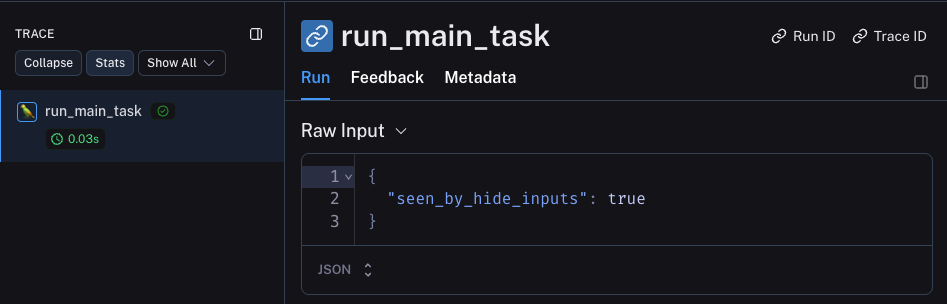
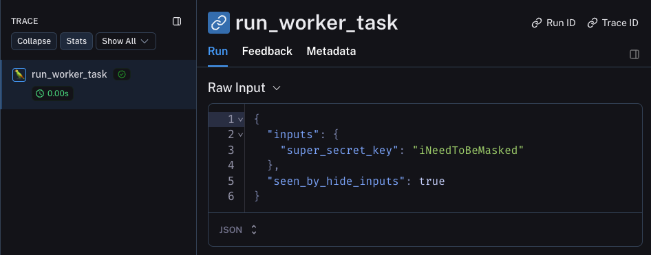
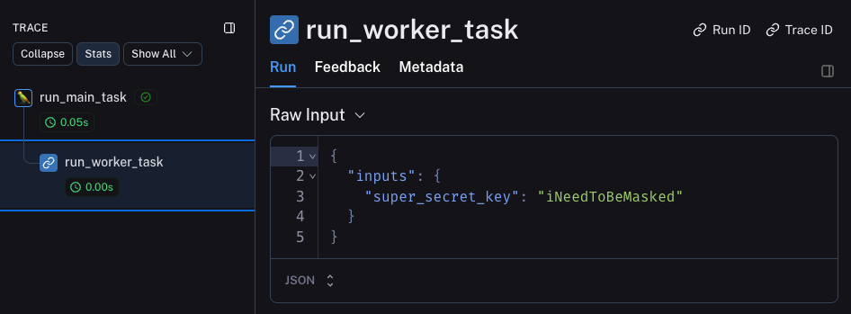

# LangSmith SDK Bug?

1. `pip install -r requirements.txt`
2. Update the LangSmith environment variables.
3. Run `python main.py`.

Observe the main and worker tasks as separate traces. Note `seen_by_hide_inputs` is present in both inputs.

4. Uncomment the `"parent"` line in `worker()`.

Observe the worker correctly being grouped with the main task, but `seen_by_hide_inputs` is no longer present.

